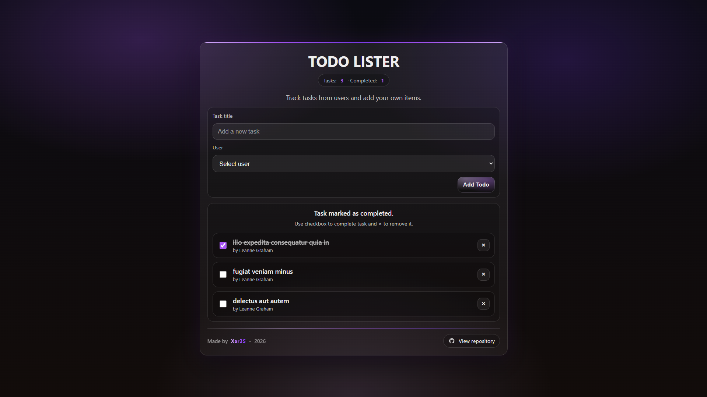

<p align="center">
  <a href="https://github.com/x4r3s/todo-lister">
    
  </a>
</p>

<p align="center">
  <a href="https://github.com/x4r3s/todo-lister">
    
  </a>
  <a href="https://github.com/x4r3s/fiery-ten/blob/main/LICENSE">
  
  </a>
</p>

<p align="center">
  <a href="https://developer.mozilla.org/en-US/docs/Web/HTML">
    
  </a>
  <a href="https://developer.mozilla.org/en-US/docs/Web/CSS">
    
  </a>
  <a href="https://developer.mozilla.org/en-US/docs/Web/JavaScript">
    
  </a>
</p>

---

## 📌 About

**TODO LISTER** is a lightweight browser-based todo manager where tasks are displayed by user, updated in-place, and tracked with live counters.

---

## 📸 Screenshoot

<p align="center">
  
</p>

---

## 🌐 Live Demo

Try the app online:

👉 **[TODO LISTER — Live Demo](https://todo-lister.xar3s.ru/)**  
<sub>Hosted via GitHub Pages</sub>

---

## 🛠 Technologies

| Technology | Description |
|-----------|-------------|
| HTML5 | Page structure |
| CSS3 | Styling and layout |
| JavaScript | Application logic |
| Fetch API | Network requests to JSONPlaceholder |

---

## 🌍 Browser Support

**TODO LISTER** works in all modern browsers:

- ✅ Google Chrome (latest)
- ✅ Mozilla Firefox (latest)
- ✅ Microsoft Edge (latest)
- ✅ Safari (latest)

> JavaScript must be enabled.

---

## 🚀 Getting Started

You can run the app locally in a few simple steps.

### 1. Clone the repository
```bash
git clone https://github.com/x4r3s/todo-lister.git
```

### 2. Open the project folder

```bash
cd todo-lister
```

### 3. Run the game

Open `index.html` directly in your browser.
